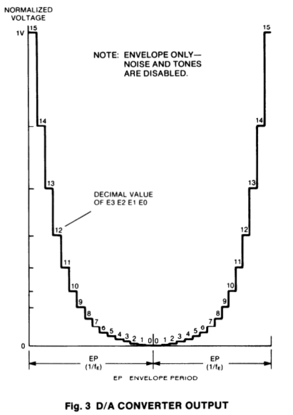
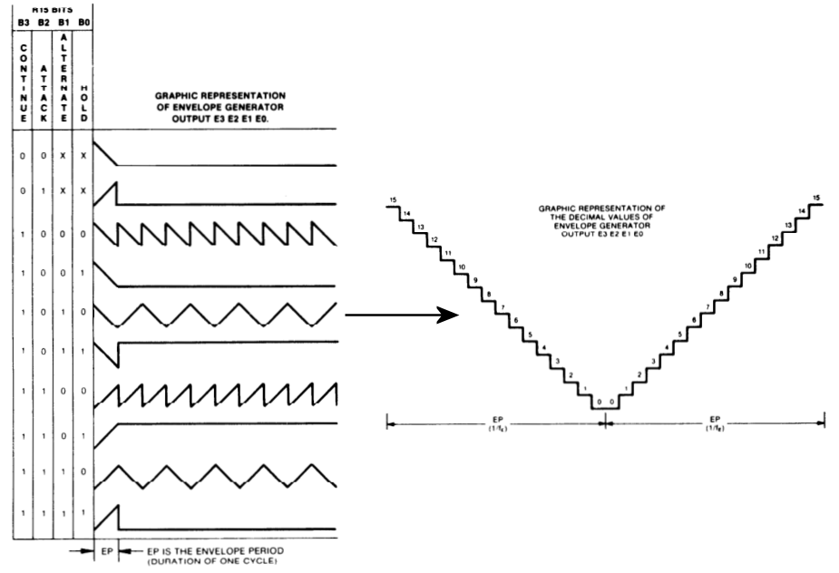
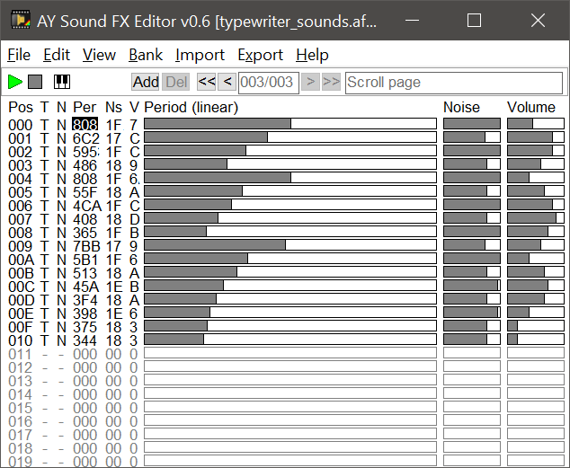
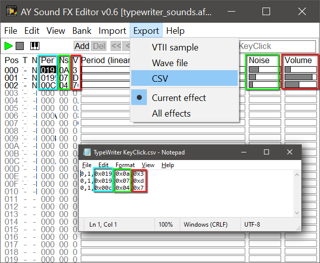

Audio
=====

- [Audio](#audio)
- [The AY-3-8912](#the-ay-3-8912)
  - [Registers](#registers)
  - [Mixer (Register 7)](#mixer-register-7)
  - [Amplitude (Registers 8, 9 and 10)](#amplitude-registers-8-9-and-10)
  - [Sample sound](#sample-sound)
  - [Enveloppe (Registers 11, 12 and 13)](#enveloppe-registers-11-12-and-13)
- [Sound Effects](#sound-effects)
  - [Commands](#commands)
  - [Example](#example)
  - [Creating new sounds](#creating-new-sounds)
- [Music](#music)
  - [Exporting musics](#exporting-musics)
  - [Exporting the events](#exporting-the-events)
  - [Using the music and events in the game](#using-the-music-and-events-in-the-game)
- [Combining Music and Sound](#combining-music-and-sound)

# The AY-3-8912
The Oric machines are equiped with a General Instruments AY-3-8912 sound generator chip running at 1mhz.

This chip is relatively common and exists in various models made by both General Instruments (AY-xxx) and Yamaha (YM-xxx) used in the Atari ST, some Sinclair Spectrum, MSX as well as Amstrad computers.

The chip in the Oric has three independent audio outputs but also a general purpose I/O port which on the Oric is connected to the keyboard[^1].

If you are interested, you can find the [datasheet](https://library.defence-force.org/books/content/datasheet/general_instrument_ay-3-8912.pdf) in the Oric library.

Here is the list of all the registers:

## Registers
|Register|Description|Content
|-|-|-|
|R0|Channel A Tone Period|Bottom 8 bits
|R1||Top 4 bits
|R2|Channel B Tone Period|Bottom 8 bits
|R3||Top 4bits
|R4|Channel C Tone Period|Bottom 8 bits
|R5||Top 4 bits
|R6|Noise Period|5 bits
|R7|Mixer|See next table
|R8|Channel A Amplitude|0-15 or 16
|R9|Channel B Amplitude|0-15 or 16
|R10|Channel C Amplitude|0-15 or 16
|R11|Envelope Period|Bottom 8 bits
|R12||Top 8 bits
|R13|Envelope Shape|4 bits
|R14|I/O port|8bits

## Mixer (Register 7)
The register 7 is important and requires a bit more details

|Bit|Use|0|1
|-|-|-|-|
|0|Channel A tone register|ON|OFF|
|1|Channel B tone register|ON|OFF|
|2|Channel C tone register|ON|OFF|
|3|Channel A noise register|ON|OFF|
|4|Channel B noise register|ON|OFF|
|5|Channel C noise register|ON|OFF|
|6|I/O port direction|Input|Output|
|7|Unused|x|x|

The important thing to notice is that the logic is inverted: When the bit is set, the corresponding channel is MUTED, so if you want the sound to play, you need to have the value set to 0.

## Amplitude (Registers 8, 9 and 10)
Each of the 3 channels accepts a value between 0 and 15 controling the amplitude (volume) on this channel: A value of 0 represents a voltage of 0v on the output of the D/A convertd, while a value of 15 outputs 1v.

The amplitude can also be set to the value 16, which means the volume is controlled by the envelope generator.

When the three channels are used at the same time, we can then output a value from 0 to 3v on the D/A output.



## Sample sound
Not important for this project but relevant for people wanting to replay sampled sound: The fact that the muting is done by forcing high the channel output means that there is actually power going out, just that because it stays at a constant level, you do not hear any sound.

But even when a channel is muted, you can still change the amplitude (volume), so you can actually replay sampled sounds by muting a channel to force it to always output voltage, then modulate the amplitude at the frequency you want to replay a sample.

Unfortunately the amplitude levels are logarithmic, so you need to conver the volume to change it back to a linear value to avoid distortion.

## Enveloppe (Registers 11, 12 and 13)
The envelope generator is an alternative way to control the volume of a chanel by automatically increasing or lowering the volue to generate various triangular and saw-tooth shapes.



The system is quite limited, but works nicely to generate metalic or gritty sounds which require quick updates without using any CPU power.

The main limitation is that there is only one genrator for all three chanels, so you can't have different shapes or frequencies on the different channels, and the volume cannot be controled anymore.

One important thing to remember: Each time the value of register 13 (envelope shape) is modified, the whole envelope generation resets[^2].

# Sound Effects
The sound effects system is using a custom system running at 200hz.
> [!NOTE]  
> The sound effects can be disabled in [params.h](../code/params.h) by commenting out **ENABLE_SOUND_EFFECTS**

For performance reason, the sound system maintains its own copy of the AY sound register, and then update the sound chip.
```c
_PsgVirtualRegisters
_PsgfreqA     .byt 0,0    //  0 1    Chanel A Frequency
_PsgfreqB     .byt 0,0    //  2 3    Chanel B Frequency
_PsgfreqC     .byt 0,0    //  4 5    Chanel C Frequency
_PsgfreqNoise .byt 0      //  6      Chanel sound generator
_Psgmixer     .byt 0      //  7      Mixer/Selector
_PsgvolumeA   .byt 0      //  8      Volume A
_PsgvolumeB   .byt 0      //  9      Volume B
_PsgvolumeC   .byt 0      // 10      Volume C
_PsgfreqShape .byt 0,0    // 11 12   Wave period
_PsgenvShape  .byt 0      // 13      Wave form
```
The reason is that some of the registers need to be updated at the bit level (like the mixer register #7), and due to the way the AY chip is interfaced with the Oric, it requires some heavy VIA twidling to perform any operations.

By having this "cache", we don't have to read back the values.

## Commands
```c
// Audio commands
#define SOUND_NOT_PLAYING        255

#define SOUND_COMMAND_END        0      // End of the sound
#define SOUND_COMMAND_END_FRAME  1      // End of command list for this frame
#define SOUND_COMMAND_SET_BANK   2      // Change a complete set of sounds: <14 values copied to registers 0 to 13>
#define SOUND_COMMAND_SET_VALUE  3      // Set a register value: <register index> <value to set>
#define SOUND_COMMAND_ADD_VALUE  4      // Add to a register:    <register index> <value to add>
#define SOUND_COMMAND_REPEAT     5      // Defines the start of a block that will repeat "n" times: <repeat count>
#define SOUND_COMMAND_ENDREPEAT  6      // Defines the end of a repeating block
```

## Example
```c ; A FREQ (LOW|HIGH), B FREQ (LOW|HIGH), C FREQ (LOW|HIGH), N FREQ, CONTROL, A VOL, B VOL, C VOL, ENV (LOW|HIGH)
;                                           0   1   2   3   4   5   6   7   8   9   10  11  12  13
_ExplodeData    .byt SOUND_COMMAND_SET_BANK,$00,$00,$00,$00,$00,$00,$1F,$07,$10,$10,$10,$00,$18,$00,SOUND_COMMAND_END
_ShootData      .byt SOUND_COMMAND_SET_BANK,$00,$00,$00,$00,$00,$00,$0F,$07,$10,$10,$10,$00,$08,$00,SOUND_COMMAND_END
_PingData       .byt SOUND_COMMAND_SET_BANK,$18,$00,$00,$00,$00,$00,$00,$3E,$10,$00,$00,$00,$0F,$00,SOUND_COMMAND_END
_KeyClickHData  .byt SOUND_COMMAND_SET_BANK,$1F,$00,$00,$00,$00,$00,$00,$3E,$10,$00,$00,$1F,$00,$00,SOUND_COMMAND_END
_KeyClickLData  .byt SOUND_COMMAND_SET_BANK,$2F,$00,$00,$00,$00,$00,$00,$3E,$10,$00,$00,$1F,$00,$00,SOUND_COMMAND_END

_ZapData        .byt SOUND_COMMAND_SET_BANK,$00,$00,$00,$00,$00,$00,$00,$3E,$0F,$00,$00,$00,$00,$00,SOUND_COMMAND_END_FRAME
                .byt SOUND_COMMAND_REPEAT,40
                .byt SOUND_COMMAND_ADD_VALUE,0,2,SOUND_COMMAND_END_FRAME
                .byt SOUND_COMMAND_ENDREPEAT      
                .byt SOUND_COMMAND_SET_VALUE,8,0,SOUND_COMMAND_END       // Finally set the volume to 0
                .byt SOUND_COMMAND_END

// 200 hz version
_TypeWriterData .byt SOUND_COMMAND_SET_BANK,$00,$00,$00,$00,$00,$00,$05,%11110111,$03,$00,$00,$00,$00,$00,SOUND_COMMAND_END_FRAME
                .byt SOUND_COMMAND_SET_VALUE,$06,$04,SOUND_COMMAND_SET_VALUE,$08,$05,SOUND_COMMAND_END_FRAME
                .byt SOUND_COMMAND_SET_VALUE,$06,$03,SOUND_COMMAND_SET_VALUE,$08,$0f,SOUND_COMMAND_END_FRAME
                .byt SOUND_COMMAND_SET_VALUE,$06,$02,SOUND_COMMAND_SET_VALUE,$08,$0D,SOUND_COMMAND_END_FRAME
                .byt SOUND_COMMAND_SET_VALUE,$06,$01,SOUND_COMMAND_SET_VALUE,$08,$0a,SOUND_COMMAND_END_FRAME
                .byt SOUND_COMMAND_SET_VALUE,$06,$01,SOUND_COMMAND_SET_VALUE,$08,$07,SOUND_COMMAND_END_FRAME
                .byt SOUND_COMMAND_SET_VALUE,8,0,SOUND_COMMAND_END                    // Finally set the volume to 0
                .byt SOUND_COMMAND_END

_SpaceBarData   .byt SOUND_COMMAND_SET_BANK,$00,$00,$00,$00,$00,$00,$08,%11110111,$03,$00,$00,$00,$00,$00,SOUND_COMMAND_END_FRAME
                .byt SOUND_COMMAND_SET_VALUE,$06,$0a,SOUND_COMMAND_SET_VALUE,$08,$05,SOUND_COMMAND_END_FRAME
                .byt SOUND_COMMAND_SET_VALUE,$06,$07,SOUND_COMMAND_SET_VALUE,$08,$0f,SOUND_COMMAND_END_FRAME
                .byt SOUND_COMMAND_SET_VALUE,$06,$05,SOUND_COMMAND_SET_VALUE,$08,$0D,SOUND_COMMAND_END_FRAME
                .byt SOUND_COMMAND_SET_VALUE,$06,$04,SOUND_COMMAND_SET_VALUE,$08,$0a,SOUND_COMMAND_END_FRAME
                .byt SOUND_COMMAND_SET_VALUE,$06,$03,SOUND_COMMAND_SET_VALUE,$08,$07,SOUND_COMMAND_END_FRAME
                .byt SOUND_COMMAND_SET_VALUE,8,0,SOUND_COMMAND_END                    // Finally set the volume to 0
                .byt SOUND_COMMAND_END
```
## Creating new sounds
The Encounter project comes with a built-in "sound board" that can be used to quickly check the various sounds and how they interact with the music.
You can easily enable the sound board by enabling both **INTRO_ENABLE_SOUNDBOARD** and **ENABLE_INTRO** defines in [params.h](../code/params.h)

To create new sounds this is not particularly practical because the project takes some time to rebuild, so instead I suggest using a combination of AY Sound FX Editor and SoundEffetEditor

There are two versions of the AY Sound Fx Editor:
- The [original one](https://shiru.untergrund.net/software.shtml) by Shiru
- The [improved one](https://github.com/Threetwosevensixseven/ayfxedit-improved) by 32767

In my tests I used the improved one, but had to use the [v0.6-full](https://github.com/Threetwosevensixseven/ayfxedit-improved/releases/tag/v0.6-full) release due to some missing Delphi dependencies (rtl250.bpl)

After launching the program you should see something like that:



I'll let you read the manual to understand how it works, but basically you can load and save sounds in a bank, navigate between the various sounds, and the editing is as simple as just using the mouse to click in the bars to change the values, then press ENTER to preview the sound.

Right now there is no direct way to import the sound in the engine, but that can be partly simplified by using the Export option.



The CVS export contains all the information for one channel:
- Tone enabled (0/1)
- Noise enabled (0/1)
- Tone period (0-4095)
- Noise period (0-31)
- Volume (0-15)


**See also:**
- [audio.s](../code/audio.s) for the sound engine implementation
- Goyo's 2019 [soundgen](https://forum.defence-force.org/viewtopic.php?p=25483#p25483)
- Rax's [SNDFX GEN](https://forum.defence-force.org/viewtopic.php?p=25431#p25431)
- Chema's [sound engine](https://forum.defence-force.org/viewtopic.php?p=9151#p9151)
 

# Music
The musics are using the Arkos Tracker 2 format running at 50hz.
> [!NOTE]  
> The music can be disabled in [params.h](../code/params.h) by commenting out **ENABLE_MUSIC**

## Exporting musics
The source format of the Arkos Tracker 2 tunes is "AKS", but to use on the Oric we need to convert them to the "AKY" format, using the 6502 source code variant.

This export can be done in the Arkos Tracker using the Export menu, but can also be automated using the command line tools present in the "tool" folder of the tracker (these have been copied to be "bin" folder).

Here are the options of the exporter:
```
Converts to AKY any song that can be loaded into Arkos Tracker 2.
Usage: SongToAky [-s <subsong number>] [-p <comma separated psg numbers>] [-reladr] [--exportAsBinary] [--encodingAddress <address>] [--labelPrefix <prefix>] [--sourceProfile <z80/68000/6502acme/6502mads>] [-spadr <address>] [-spcom "<xxx>"] [-spskipcom] [-spbyte "<xxx>"] [-spword "<xxx>"] [-spstr "<xxx>"] [-spprelbl "<xxx>"] [-sppostlbl "<xxx>"] [-spbig] [--exportPlayerConfig] <path to input song> <path to output AKY>

<path to input song>               Path and filename to the song to load.
<path to output AKY>               Path and filename to the AKY file to create.
-s, --subsong                      The subsong number (>=1). 1 is default.
-p, --psgs                         The PSG numbers (>=1), comma separated (example: 1,2,3. 1 is default).
-bin, --exportAsBinary             If present, exports as a binary file. If not, exports as source (default).
-adr, --encodingAddress            If present, encodes the file to this address (may be hex (0xa000 for example)). Mandatory if encoding as binary.
--labelPrefix                      Useful for source generation. Indicates a prefix to all the labels.
--sourceProfile                    When generating the sources, indicates what source profile to use (among z80, 68000, 6502acme, 6502mads). Default is z80. If the export is binary, z80 must be chosen. Mnemonics can be overridden by the other related command line parameters.
-spadr                             When generating the sources, overrides the mnemonic to set the current address ("org" for example). Can be put between "".
-spcom                             When generating the sources, overrides the string to declare a comment (";" for example). Can be put between "".
-spskipcom                         When generating the sources, skips the comments if present.
-spbyte                            When generating the sources, overrides the mnemonic to declare a byte ("db" for example). Can be put between "".
-spword                            When generating the sources, overrides the mnemonic to declare a word ("dw" for example). Can be put between "".
-spstr                             When generating the sources, overrides the mnemonic to declare a string ("ds" for example). Can be put between "".
-spprelbl                          When generating the sources, defines a prefix to every label ("." for example). Can be put between "".
-sppostlbl                         When generating the sources, defines a postfix to every label (":" for example). Can be put between "".
-spbig                             When generating the sources, declares big-endianness if present.
-spomt                             When generating the sources, only one mnemonic type per line, if present.
--exportPlayerConfig               Exports a player configuration source file, if present.
-reladr                            If present, all the encoded label references will be relative to the start of the song (for example: "dw myLabel - songStart"). Useful mostly for Atari ST players.
```

For OSDK compatibility, we select the **6502acme** export format, but with different keywords for the encoding (**.byt** instead of **db** and **.word** instead of **dw**), which gives the following command line:

> bin\SongToAky --sourceProfile 6502acme -spbyte ".byt" -spword ".word" data\<source file>.aks code\<target file>.s

## Exporting the events
Events are not technically part of the music, but they are practical to synchronize the music with whatever happens on the screen.

These need to be exported separately
```
Generates a file in the Events export format, from any song that can be loaded into Arkos Tracker 2.
Usage: SongToEvents [-s <subsong number>] [--exportAsBinary] [--encodingAddress <address>] [--labelPrefix <prefix>] [--sourceProfile <z80/68000/6502acme/6502mads>] [-spadr <address>] [-spcom "<xxx>"] [-spskipcom] [-spbyte "<xxx>"] [-spword "<xxx>"] [-spstr "<xxx>"] [-spprelbl "<xxx>"] [-sppostlbl "<xxx>"] [-spbig] <path to input song> <path to output Events file>

<path to input song>               Path and filename to the song to load.
<path to output Events>            Path and filename to the Events file to create.
-s, --subsong                      The subsong number (>=1). 1 is default.
-bin, --exportAsBinary             If present, exports as a binary file. If not, exports as source (default).
-adr, --encodingAddress            If present, encodes the file to this address (may be hex (0xa000 for example)). Mandatory if encoding as binary.
--labelPrefix                      Useful for source generation. Indicates a prefix to all the labels.
--sourceProfile                    When generating the sources, indicates what source profile to use (among z80, 68000, 6502acme, 6502mads). Default is z80. If the export is binary, z80 must be chosen. Mnemonics can be overridden by the other related command line parameters.
-spadr                             When generating the sources, overrides the mnemonic to set the current address ("org" for example). Can be put between "".
-spcom                             When generating the sources, overrides the string to declare a comment (";" for example). Can be put between "".
-spskipcom                         When generating the sources, skips the comments if present.
-spbyte                            When generating the sources, overrides the mnemonic to declare a byte ("db" for example). Can be put between "".
-spword                            When generating the sources, overrides the mnemonic to declare a word ("dw" for example). Can be put between "".
-spstr                             When generating the sources, overrides the mnemonic to declare a string ("ds" for example). Can be put between "".
-spprelbl                          When generating the sources, defines a prefix to every label ("." for example). Can be put between "".
-sppostlbl                         When generating the sources, defines a postfix to every label (":" for example). Can be put between "".
-spbig                             When generating the sources, declares big-endianness if present.
-spomt                             When generating the sources, only one mnemonic type per line, if present.
```

For OSDK compatibility, we select the **6502acme** export format, but with different keywords for the encoding (**.byt** instead of **db** and **.word** instead of **dw**), which gives the following command line:

> bin\SongToEvents --sourceProfile 6502acme -spbyte ".byt" -spword ".word" data\<source file>.aks code\<target file>.s

Here is typically what an event file would look like:
```c
// Events generated by Arkos Tracker 2.
Events
  .word 769 // Wait for 768 frames.
  .byt 0

Events_Loop
  .word 769 // Wait for 768 frames.
  .byt 0

  .word 0   // End of sequence.
  .word Events_Loop // Loops here.
```

## Using the music and events in the game
First you need to have **akyplayer.s** in the project, and then include the music using something like that:

```c
_IntroMusic
.(
    .dw events
    .byt 1+2+4+8+16+32        // All the three channels are used
#include "intro_music.s"
events
#include "intro_music_events.s"
.)
```
The first word is a pointer to the events table, followed by a byte containing a bitmask used by the sound mixer to determine how many channels from the musics should be taken into consideration, which is important when you want to play sound effects while a music track is playing.

Then call **PlayMusic(IntroMusic);** to start the music and **EndMusic();** to stop it


# Combining Music and Sound
It's technically possible to replay sound effects using the Arkos tracker, but by running at 50hz that would not be sufficient to replay sounds of good enough quality.

I had to come up with a way to share the sound system, which as indicated previously uses a bit mask on the music to indicate which registers are used by the music and which ones are free for use by the sound effects.

The code uses two tables for the AY register values, plus some flags, definitely not optimal and may be revisited at some point.


---
[^1]: This is quite important, if you don't set-up the chip registers properly, you may end up losing access to the keyboard, so be careful when playing with the registers 7 (which control the port direction) and 14 (which is used for the data transfer).

[^2]: This is the main reason why when recording "register dumps" you need to precisely record if the register 13 was touched or not, else when being replayed the music will not sound quite right.
