> [!WARNING]  
> This page contains potential spoilers for the game.  
> If you plan to play the game, you should probably refrain to go farther!
>
> For more information, you can safely read [Encounter.md](../Encounter.md)

# Game design discussion

## The original game
When the original game was released, in 1983, the standard text adventure game on the machine were sharing a number of characteristics:
- You navigate through multiple locations using NSEW directions, and sometimes Up and Down as well
  - It is non uncommon that the relation between the various locations and doors makes no sense from a map point of view
- You have no way to avoid traps: The entire design is based on failing, and learning from failures:
  - What's you command? 
    - East: Some poisoned arrow erupt from the wall. You are dead.
    - North: A hidden trap door opend under your feet. You are dead.
    - West: As you enter the room the door close and starts to fill with acid gaz. You are dead.
    - etc...
- Objects and interactions are often illogical and require testing all possible combinations
- The environment is fantastic and rarely follow the normal rules of our universe:
  - Trapped in the house of a sadistic canibal which is larger inside than outside
  - Investigating a space ship or futuristic laboratory
  - Some Twilight Zone style place filled with robots, orcs, magicians and teleporters
  - Etc...

Compared to most games on the machine, Encounter is quite sane:
- The adventure is in the everyday world (England in the 80ies)
- The player is just a normal investigator without any special gadgets or powers
- The map is mostly consistent and can be imagined as a place that could actually exist
- The actions mostly make sense - at least if you ignore the actual potency of chemical products -

## Modern adventure games
The adventure game genre has never really vanished, and modern implementations of text adventure engines have been released and ported to modern machines, making it easy for anyone to make their own game. All you need to do is to define some "locations", some "items", link and place everything together, define some vocabulary and actions, a few rules, type the descriptions, and there you are.

Some people decided to write their own engine, like Eric Safar when he worked on his Athanor game series on various retro machines, but ultimately it's not the engine that generally dictates how good the game is going to be in the end, it's how it's all linked together.

## Encounter HD
One of my personal pet peves in these games is when the difficulty is artificially created by having non-sensical maps, item used that make no sense, and obscure vocabulary to do the most basic of operations.

So for Encounter I gave myself a few constraints:
- The navigation on the map HAS to make sense:
  - If you came from the previous room by the EAST entrance, then there should be a WEST direction allowing you to go back to the place you came from.
  - Drawing on a map the list of locations and their directions, there should be no crossing lines, it should all make sense.
- The map itself should feel logical:
  - You should not have sequences where you go from the sewers to the forest to the bathroom and finally to the launch-pad for a rocket
  - If you enter what looks like a garden shed, it should not have the equivalent of the Empire State Building number of rooms inside
- The items and how you use them should be possible to guess.
  - Things like "put the flower pot on top of the dog to trigger the opening of the garage door where the submarine is parked" are not acceptable.  
- There should not be immediate and impossible to avoid failure conditions  

So, concretely, how does that translate in the changes made to the original Encounter game?
- In the original game, if you go "east" from the Narrow Path, you immediately fall into the pit which you did not even know was there.
  - I fixed that by adding a new location where the pit is present and clearly shown to the player
- In the original game, if you enter the main hall of the house, there is no way to avoid the dog attacking you if you are not equipped yet
  - In the new version, the dog will let you leave the room if you don't try to access the top stair
- Most of the topology in the original game made sense, but when converting to graphics it made the placement of doors difficult, so I add to change a couple locations to make the connection between the room easier to understand
- A couple places are not following the rules, but it's actually less worse than following them:
  - The gloomy stair case between the kitchen and the basement is shown in a Point Of View of the player despite the kitchen having the stair on the right side and the basement having it on the left side... but since it's changing level, it stays consistent because we use UP and DOWN, and these match just fine. 
- I replaced the "you have 500 action points" by an actual count down clock

In addition, the new game also has:
- Some intro sequence
- The high scores are saved to disk
- There is an end credits sequences
- Each scene is now visible graphically
- And ideally some sound effects and music will be played where necessary

# Technical considerations

## Graphical choices
Tradionally, due to the storage medium being tapes, most Oric games either had no graphics at all, or were using vector graphics in HIRES mode using lines and flood fill, generally on the entire 240x200 HIRES screen, leaving just three lines of TEXT at the bottom for the interactions.

More avanced games tend to use a part of the HIRES screen to print descriptions, but pretty much all of them kept the entire screen in HIRES instead of using the bottom part in TEXT, which has a serious impact in term of memory and performance.

||||||
|-|-|-|-|-|
|Encounter|The Hobbit|Le Manoir du Dr Genius|Athanor|Athanor 2|
|1983|1983|1984|2014|2022|
|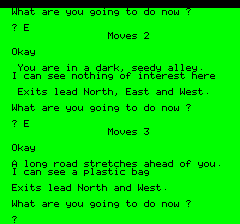|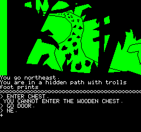|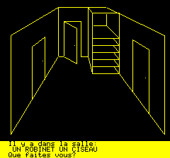|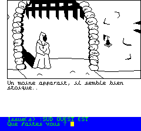|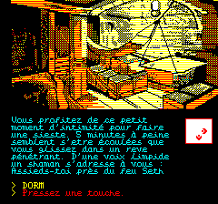

For Encounter I chose to restrict the graphics to a 240x128 pixels window, enough to show some nice hand drawn images without filling the entire floppy disk, while also leaving room to display text, the inventory and extra information such as the score and remaining time.

Contrarily to the games above, the text area is actually in TEXT mode, which allows for quick display of text and is more memory efficient.

|||||
|-|-|-|-|
|Main street|Old-fashioned well|Entrance hall|Kitchen|
|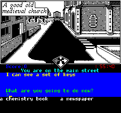||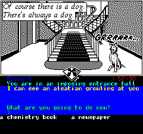|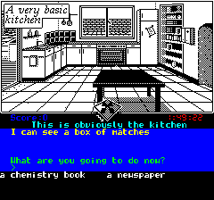

If we zoom on the scene, here is the content:

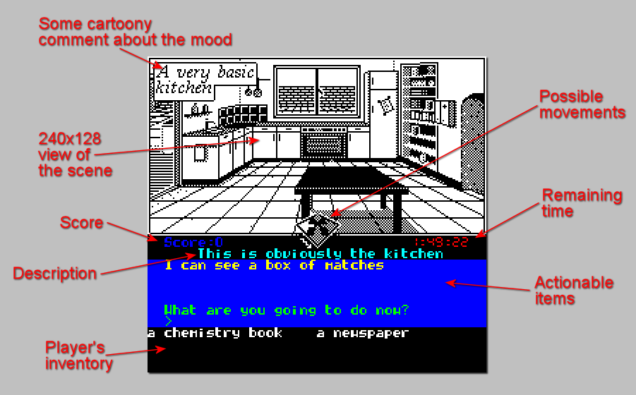

## Video mode
To achieve this layout, the code needs to put some video attributes to do the change from TEXT to HIRES and HIRES to TEXT, the challenging part is essentially that you have to be careful to not erase the attributes by mistake, like for example when clearing the screen and updating the images.

The 240x128 size for the image is limited by the location of the charset data for the TEXT mode, it could be less than 128 lines tall, but any vertical size bigger than 128 would result in a unusable TEXT area since the character set would be overwritten by the the HIRES image content.

Due to these considerations, the small directional cross at the center of the screen had to be implemented using a hybrid HIRES/TEXT combination:
- The top half of the cross is drawn on the HIRES part of the screen
- The bottom half is made of 5 redefined characters from the ALTernate charset

## Fades and transisions
Since the game is all in Black & White, it can easily look quite dry, so to make it less boring I decided to try to "cross-fade" the scenes.

Since the Oric does not have any bitplans or color palettes, the "fade" effect had to be done at the pixel level, in this particular case using some dithering matrix patterns to select which of the pixels to mask-in/mask-out from both images.

The performance is not particularly incredible, but is "good enough" for the type of effect I was looking for.

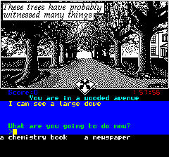

The same fade effect is used to make items and overlays displayed on top of the scene.

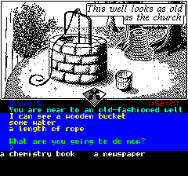
