> [!WARNING]  
> This page contains potential spoilers for the game.  
> If you plan to play the game, you should probably refrain to go farther!
>
> For more information, you can safely read [Encounter.md](../Encounter.md)

# Locations
There are about 40 locations in the game, some can be directly accessed while some other require the player to do special actions such as opening a lock of bypassing an oponent or some other dangerous trap.

# The outside
## You are in a deserted market square
This is where the player starts their adventure.

## You are in a dark, damp tunnel
This humid tunnel contains **salpeter** you can use to make **explosive powder**.

## You are in a wooded avenue
Contains a **dove** that you can capture with the **fishing net**.

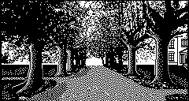

## You are near to an old-fashioned well
Near the well you will find a **bucket** as well as some **rope**, and obviously some **water**.

## You are in a dark, seedy alley
This where you find the **plastic bag**

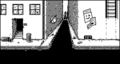

## A long road stretches ahead of you
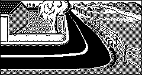

## You are on the main street
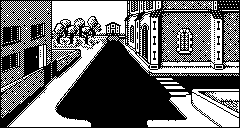

## You are on a narrow path
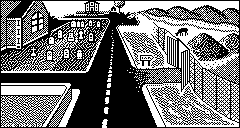

## You are in an open area of tarmac
The **car** is a source of **rusted** metal and **petrol**

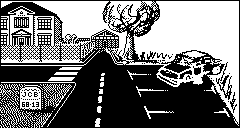

## Outside a deep pit
This location did not exist in the original 1983 game, just going "east" would make you fall down in to the pit.
By adding this location, the player has to make a conscious effort instead of being surprised.

## You are inside a deep pit
The pit contains some **sulfur** which can be mixed with the **salpeter** to create the **explosive powder**

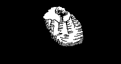

# Outside the manor
## You are on a wide gravel drive
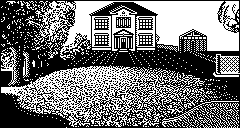

## You are on a huge area of lawn
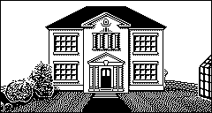

## You are in a relaxing zen garden
The garden contains a **hose pipe**

## You are on a lawn tennis court

## You are standing by a fish pond
This is where you find the **fishing net**

## You are on a tiled patio
Above the passage is the **window** of the room where the **hostage** is being kept.
Trying to break the window triggers the **alarm**

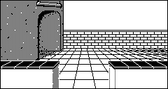

## You are in an apple orchard
Here you can find a **ladder** which can be used to go down the **pit**

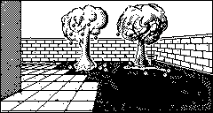

## You are in a vegetable plot
A **knife** is lying around.  
On the wall you can see the small window to the basement dark room.

## You are in a small greenhouse
The greenhouse contains a **cardboard box**

# The manor
## The first floor
## You are in an imposing entrance hall
The entrance hall is guardeed by a very angry **dog**

## You are in the lounge
Here you can find a **tobacco tin** container.

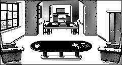

## This looks like a library
In the library you will find a **chemistry book** providing some **chemistry recepies** as well as a **map** of England.

## A dining room, or so it appears
On the dinning table is a **joint of meat** which the **dog** will surrely appreciate, as well as some **bread** designed to attract the **dove**.

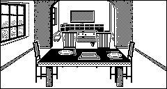

## This looks like a games room
On the pool table you will find a **snooker cue** which can be used for various purposes.

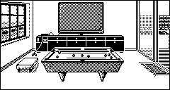

## You find yourself in a sun-lounge

## This is obviously the kitchen
The kitchen contains a **box of matches** 

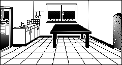

## You are in a narrow passage
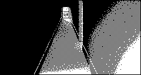

## The second floor
## You are on a sweeping staircase
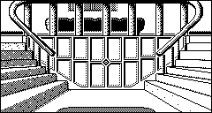

## You are on the main landing
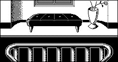

## This is the west gallery
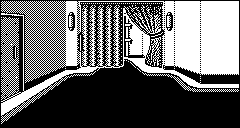

## You see a padlocked steel-plated door
This reinforced **door** blocks the player to access to the **kidnapped girl**.

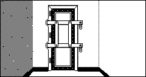

## This is a small box-room
Contains a small **note** informing the player that some stuff is stored in the **safe** in the basement.

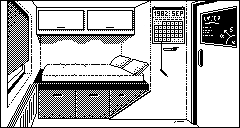

## This seems to be a guest bedroom
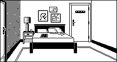

## You are in a tiled shower-room

## You have found the east gallery

## You are in an ornate bathroom
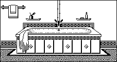

## This must be the master bedroom
A **thug** is sleeping on the bed, he has a bunch of things in his pockets.

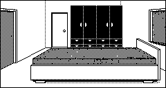

## This is a tiny toilet
Here you can find a **roll of toilet paper**

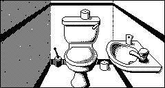

## This is a child's bedroom
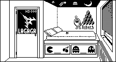

## The basement
## You are on some gloomy, narrow steps
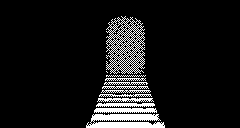

## This is a cold, damp cellar
The cellar contains a **safe** which has some **dangerous chemicals** in it, including a small **bottle of acid**.

## This room is even darker than the last
This is where you find the **control panel** that control the **alarm**.

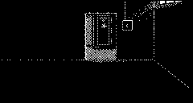

