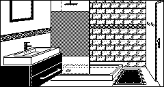

> [!WARNING]  
> This page contains potential spoilers for the game.  
> If you plan to play the game, you should probably refrain to go farther!
>
> For more information, you can safely read [Encounter.md](../Encounter.md)
- [Locations](#locations)
- [Locations in the code](#locations-in-the-code)
- [Description of the various locations](#description-of-the-various-locations)
- [The village](#the-village)
- [Outside the manor](#outside-the-manor)
- [The manor](#the-manor)
  - [The first floor](#the-first-floor)
  - [The second floor](#the-second-floor)
  - [The basement](#the-basement)


# Locations
There are about 40 locations in the game, some can be directly accessed while some other require the player to do special actions such as opening a lock of bypassing an oponent or some other dangerous trap.

----
# Locations in the code 
Locations are defined in a static array containing all the locations: 

```
typedef struct 
{
  unsigned char directions[e_DIRECTION_COUNT_];   // +0 The six possible directions (NSEWUP)
  const char* description;                        // +6 The one line description of the place, displayed at the top of the TEXT area
  const char* script;                             // +8 Additional list of commands to add elements to the graphical view (speech bubble, etc...)
} location;  // sizeof = 10 bytes

extern location gLocations[e_LOCATION_COUNT_];      // Array containing all the locations
```

The current location of the player is stored in a global variable, and a pointer to the current location is also available for performance reason.
```
extern unsigned char gCurrentLocation;
extern location* gCurrentLocationPtr;
```

**See:**
- [game_enums.h](../code/game_enums.h) for the list of all locations
- [game_defines.h](../code/game_defines.h) for the structures and declarations
- [Scripting](scripting.md) for more details about how the **script** commands work


----
# Description of the various locations

Here are information about the various locations you can reach in the game, grouped geographically:
- The village area
- The grounds around the manor house
- The three levels of the house

# The village
|Image|Description|
|-|-|
|**You are in a deserted market square**|e_LOCATION_MARKETPLACE|
||This is where the player starts their adventure.|
|**You are in a dark, damp tunnel**|e_LOCATION_DARKTUNNEL|
||This humid tunnel contains **salpeter** you can use to make **explosive powder**.|
|**You are in a wooded avenue**|e_LOCATION_WOODEDAVENUE|
||Contains a **dove** that you can capture with the **fishing net**.|
|**You are near to an old-fashioned well**|e_LOCATION_WELL|
||Near the well you will find a **bucket** as well as some **rope**, and obviously some **water**.|
|**You are in a dark, seedy alley**|e_LOCATION_DARKALLEY|
||This where you find the **plastic bag**|
|**You are on the main street**|e_LOCATION_MAINSTREET|
|||
|**You are in an open area of tarmac**|e_LOCATION_TARMACAREA|
||The **car** is a source of **rusted** metal and **petrol**|
|**You are on a narrow path**|e_LOCATION_NARROWPATH|
|||
|**A long road stretches ahead of you**|e_LOCATION_ROAD|
|||
|**Outside a deep pit**|e_LOCATION_OUTSIDE_PIT
||This location did not exist in the original 1983 game, just going "east" would make you fall down in to the pit.<br>By adding this location, the player has to make a conscious effort instead of being surprised.|
|**You are inside a deep pit**|e_LOCATION_INSIDEHOLE|
||The pit contains some **sulfur** which can be mixed with the **salpeter** to create the **explosive powder**|

# Outside the manor
|Image|Description|
|-|-|
|**You are on a wide gravel drive**|e_LOCATION_GRAVELDRIVE|
|||
||**You are on a huge area of lawn**|e_LOCATION_LAWN|
|||
|**You are in a relaxing zen garden**|e_LOCATION_ZENGARDEN|
||The garden contains a **hose pipe**|
|**You are on a lawn tennis court**|e_LOCATION_TENNISCOURT|
|||
|**You are standing by a fish pond**|e_LOCATION_FISHPND|
||This is where you find the **fishing net**|
|**You are on a tiled patio**|e_LOCATION_TILEDPATIO|
||Above the passage is the **window** of the room where the **hostage** is being kept.<br>Trying to break the window triggers the **alarm**|
|**You are in an apple orchard**|e_LOCATION_APPLE_TREES|
||Here you can find a **ladder** which can be used to go down the **pit**|
|**You are in a vegetable plot**|e_LOCATION_VEGSGARDEN|
||A **knife** is lying around.<br>On the wall you can see the small window to the basement dark room.<br>See: 'Soupirail', 'Fenêtres de trémie', 'Vasistas', 'Hopper window', 'Kellerfenster'|
|**You are in a small greenhouse**|e_LOCATION_GREENHOUSE|
||The greenhouse contains a **cardboard box**|

# The manor
## The first floor

|Image|Description|
|-|-|
|**You are in an imposing entrance hall**|e_LOCATION_ENTRANCEHALL|
||The entrance hall is guardeed by a very angry **dog**|
|**You are in the lounge**|e_LOCATION_LOUNGE|
||Here you can find a **tobacco tin** container.|
|**This looks like a library**|e_LOCATION_LIBRARY|
||In the library you will find a **chemistry book** providing some **chemistry recepies** as well as a **map** of England.|
|**A dining room, or so it appears**|e_LOCATION_DININGROOM|
||On the dinning table is a **joint of meat** which the **dog** will surrely appreciate, as well as some **bread** designed to attract the **dove**.|
|**This looks like a games room**|e_LOCATION_GAMESROOM|
||On the pool table you will find a **snooker cue** which can be used for various purposes.|
|**You find yourself in a sun-lounge**|e_LOCATION_SUNLOUNGE|
|||
|**This is obviously the kitchen**|e_LOCATION_KITCHEN|
||The kitchen contains a **box of matches** |
|**You are in a narrow passage**|e_LOCATION_NARROWPASSAGE|
|||

## The second floor

|Image|Description|
|-|-|
|**You are on a sweeping staircase**|e_LOCATION_LARGE_STAIRCASE|
|||
|**You are on the main landing**|e_LOCATION_UP_STAIRS|
|||
|**This is the west gallery**|e_LOCATION_WESTGALLERY|
|||
|**You see a padlocked steel-plated door**|e_LOCATION_PADLOCKED_ROOM|
||This reinforced **door** blocks the player to access to the **kidnapped girl**.|
|**This is a small box-room**|e_LOCATION_BOXROOM|
||Contains a small **note** informing the player that some stuff is stored in the **safe** in the basement.|
|**This seems to be a guest bedroom**|e_LOCATION_GUESTBEDROOM|
|||
|**You are in a tiled shower-room**|e_LOCATION_SHOWERROOM|

|**You have found the east gallery**|e_LOCATION_EASTGALLERY|

|**You are in an ornate bathroom**|e_LOCATION_CLASSY_BATHROOM|
|||
|**This must be the master bedroom**|e_LOCATION_MASTERBEDROOM|
||A **thug** is sleeping on the bed, he has a bunch of things in his pockets.|
|**This is a tiny toilet**|e_LOCATION_TINY_WC|
||Here you can find a **roll of toilet paper**|
|**This is a child's bedroom**|e_LOCATION_CHILDBEDROOM|
|||

## The basement
|Image|Description|
|-|-|
|**You are on some gloomy, narrow steps**|e_LOCATION_NARROWSTAIRCASE|
|||
|**This is a cold, damp cellar**|e_LOCATION_CELLAR|
||The cellar contains a **safe** which has some **dangerous chemicals** in it, including a small **bottle of acid**.|
|**This room is even darker than the last**|e_LOCATION_DARKCELLARROOM||
||This is where you find the **control panel** that control the **alarm**.|

