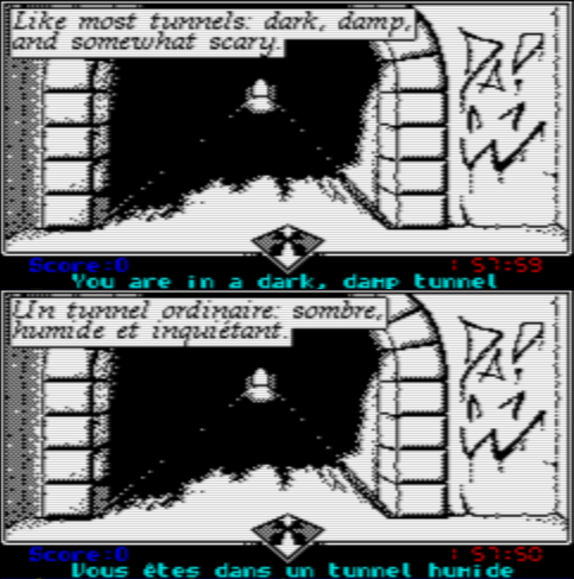
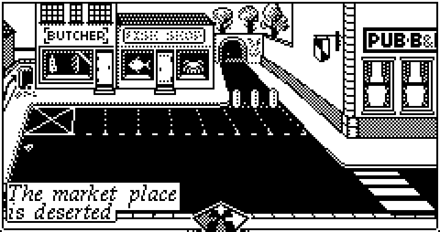

Scripting
=========
Somes games have hardcoded logic, some are completely data-driven, Encounter is somewhat in-between, with most of the player actions directly coded in normal language, while the scenes themselves use a tiny scripting system designed to be memory efficient


- [Scripting](#scripting)
- [Features](#features)
  - [The concept](#the-concept)
  - [Types of scripts](#types-of-scripts)
    - [Location scripts](#location-scripts)
    - [Action scripts](#action-scripts)
    - [Game script](#game-script)
- [Commands](#commands)
  - [END](#end)
  - [END\_AND\_REFRESH](#end_and_refresh)
  - [WAIT](#wait)
  - [JUMP](#jump)
  - [Conditional jumps](#conditional-jumps)
    - [JUMP\_IF\_TRUE](#jump_if_true)
    - [JUMP\_IF\_FALSE](#jump_if_false)
  - [Operators](#operators)
    - [CHECK\_ITEM\_LOCATION](#check_item_location)
    - [CHECK\_ITEM\_FLAG](#check_item_flag)
    - [CHECK\_PLAYER\_LOCATION](#check_player_location)
  - [Providing information to the player](#providing-information-to-the-player)
    - [INFO\_MESSAGE](#info_message)
    - [ERROR\_MESSAGE](#error_message)
  - [Changing item properties](#changing-item-properties)
    - [SET\_ITEM\_LOCATION](#set_item_location)
    - [SET\_ITEM\_FLAGS](#set_item_flags)
    - [UNSET\_ITEM\_FLAGS](#unset_item_flags)
    - [SET\_ITEM\_DESCRIPTION](#set_item_description)
  - [Changing locations properties](#changing-locations-properties)
    - [SET\_LOCATION\_DIRECTION](#set_location_direction)
  - [Scoring and achievements](#scoring-and-achievements)
    - [UNLOCK\_ACHIEVEMENT](#unlock_achievement)
    - [INCREASE\_SCORE](#increase_score)
  - [DISPLAY\_IMAGE](#display_image)
  - [DRAW\_BITMAP](#draw_bitmap)


# Features
The main feature of the scripts is to populate the scene images with the proper content, like speech bubles and items, or draw the game-over sequence, but also to handle in a memory efficient way the most common actions the player can do (like use an item, read something, etc...)

The [location](locations.md) structure contains a **script** field with a pointer to a script executed each time a scene is drawn.

## The concept
A script is just a sequence of commands, a byte stream really, with a final "end" command.

A stream is launched with the **PlayStream** function, and the bytecode execute all the commands immediately until it either reach the end of the stream or encounter a "Wait" instruction, this basically is the equivalent of having a "setup" phase followed by some more stuff happening later.

Typically the setup will be in charge of checking the state of the game to draw and print different elements depending of the context, and the rest will be these description bubbles which appear over time to make the game "more alive" than a standard text adventure game.

Scripts can also loop and branch, basic conditions are supported.

## Types of scripts
Technically, all the scripts can use all the commands, but there are three main use cases for scripts:
### Location scripts
Each of the in-game [location](locations.md) has an associated script pointer, which in Encounter is used to display the description bubbles, draw relevant items in the scene, or check for game-over conditions.

Let's examine two of the first locations, the **market place** and the **dark tunel**, these are defined like that in the [game_data.c](../code/game_data.c):
```c
location gLocations[e_LOCATION_COUNT_] =
{ 
  { // e_LOCATION_MARKETPLACE     
    e_LOCATION_DARKTUNNEL,      // Location to the North
    e_LOCATION_NONE,            // Location to the South
    e_LOCATION_DARKALLEY,       // Location to the East
    e_LOCATION_NONE,            // Location to the West
    e_LOCATION_NONE,            // Location going up
    e_LOCATION_NONE,            // Location going down
    gTextLocationMarketPlace,   // Description
    gDescriptionMarketPlace     // Script
  },         
  { // e_LOCATION_DARKTUNNEL 
    e_LOCATION_WOODEDAVENUE,    // Location to the North
    e_LOCATION_MARKETPLACE,     // Location to the South
    e_LOCATION_NONE,            // Location to the East
    e_LOCATION_NONE,            // Location to the West
    e_LOCATION_NONE,            // Location going up
    e_LOCATION_NONE,            // Location going down
    gTextLocationDarkTunel,     // Description
    gDescriptionDarkTunel       // Script
  },
  (...)
}
```
The dark tunel script is the simplest one, it just shows some text bubbles commenting about the scene:
```c
_gDescriptionDarkTunel
    WAIT(DELAY_FIRST_BUBBLE)         // Wait about a quarter of a second
    WHITE_BUBBLE(2)                  // This bubble has two line entries
#ifdef LANGUAGE_FR                   // Line entries for the French version
    _BUBBLE_LINE(4,4,0,"Un tunnel ordinaire: sombre,")
    _BUBBLE_LINE(4,13,1,"humide et inquiétant.")
#else                                // Line entries for other versions (English is default)
    _BUBBLE_LINE(4,4,0,"Like most tunnels: dark, damp,")
    _BUBBLE_LINE(4,13,1,"and somewhat scary.")
#endif    
    END                              // End of script
```
To provide some cartoony feeling, the game is using the scripting system to display some messages over time.

Delays are done with the **WAIT** instruction, while the **WHITE_BUBBLE** (or **BLACK_BUBBLE**) and **_BUBBLE_LINE** are used to display the text bubbles.

When running the game, when the tunnel location is accessed, the player will see the following:



Because of the END instruction, this script stops there and is not active anymore, but a script does not have to finish, in which case it will keep running in the background until the player moves to another location or some internal flags ends up impacting the script flow.

The market place script is more complex and shows a blinking neon sign[^1] done by updating the graphics on the scene, waiting a bit, updating graphics again, looping, etc...


```c
_gDescriptionMarketPlace
    WAIT(DELAY_FIRST_BUBBLE)         // Wait about a quarter of a second
    WHITE_BUBBLE(2)                  // This bubble has two line entries
#ifdef LANGUAGE_FR                   // Line entries for the French version    
    _BUBBLE_LINE(4,100,0,"La place du marché")
    _BUBBLE_LINE(4,106,4,"est désertée")
#else                                // Line entries for other versions (English is default)
    _BUBBLE_LINE(4,100,0,"The market place")
    _BUBBLE_LINE(4,106,4,"is deserted")
#endif    
blinky_shop                          // Label
    DRAW_BITMAP(LOADER_SPRITE_ITEMS,BLOCK_SIZE(8,11),40,_SecondImageBuffer+(40*116)+32,$a000+(14*40)+11)    // Draw the Fish Shop "grayed out"
    WAIT(50)                         // Wait one second
    DRAW_BITMAP(LOADER_SPRITE_ITEMS,BLOCK_SIZE(8,11),40,_SecondImageBuffer+(40*104)+32,$a000+(14*40)+11)    // Draw the Fish Shop "fully drawn"
    WAIT(50)                         // Wait one second
    JUMP(blinky_shop)                // Jump to the label
```
Which will result in the following sequence:



The system does not support moving objects, but it's good enough for things that change state or cycling animations.

### Action scripts
Action scripts are triggered when the player do some explicit action like using an object, looking at something, etc...

Some of the actions done by the player, like reading the newspaper, or looking at the map in the library result in the game loading a fullscreen image, then show some comments about the action.

Here is a very simple script which shows a picture of a newspaper with somme comments, if the player decides to read it
```c
_gSceneActionReadNewsPaper
    DISPLAY_IMAGE(LOADER_PICTURE_NEWSPAPER,"The Daily Telegraph, September 29th")
    INFO_MESSAGE("I have to find her fast...")
    WAIT(50*2)
    INFO_MESSAGE("...I hope she is fine!")
    WAIT(50*2)
    END_AND_REFRESH
```
And here is what that looks like in the game.


Actions can also trigger other scripts, change variables, move things around, etc... 

### Game script
> [!WARNING]  
> TODO: This section is possibly not valid anymore.

There is only a single game script for the entire game, but technically it should be trivial to have multiple ones or change it at run time.

The purpose of this script is to do book-keeping and adjustments independently of where the player is located.


# Commands
The commands are all defined in [scripting.h](../code/scripting.h) and implemented in [bytestream.s](../code/bytestream.s) and most of them use references to locations and item ids defined in [game_enums.h](../code/game_enums.h).

```C
#define OFFSET(x,y) x,y
#define BLOCK_SIZE(w,h) w,h
#define STRIDE(b) b
#define RECTANGLE(x,y,w,h) x,y,w,h

// Command opcodes
#define COMMAND_END             0
#define COMMAND_RECTANGLE       1
#define COMMAND_FILL_RECTANGLE  2
#define COMMAND_TEXT            3
#define COMMAND_WHITE_BUBBLE    4
#define COMMAND_BLACK_BUBBLE    5
#define COMMAND_WAIT            6
#define COMMAND_BITMAP          7
#define COMMAND_FADE_BUFFER     8
#define COMMAND_JUMP            9      // Really, that's a GOTO :p
#define COMMAND_JUMP_IF_TRUE    10
#define COMMAND_JUMP_IF_FALSE   11
#define COMMAND_INFO_MESSAGE    12 
#define COMMAND_FULLSCREEN_ITEM 13
#define COMMAND_STOP_BREAKPOINT 14
#define COMMAND_END_AND_REFRESH 15
#define COMMAND_ERROR_MESSAGE   16
#define COMMAND_SET_ITEM_LOCATION   17
#define COMMAND_SET_ITEM_FLAGS  18
#define COMMAND_UNSET_ITEM_FLAGS 19
#define COMMAND_SET_ITEM_DESCRIPTION 20
#define COMMAND_SET_LOCATION_DIRECTION 21
#define COMMAND_UNLOCK_ACHIEVEMENT 22
#define COMMAND_INCREASE_SCORE 23
#define _COMMAND_COUNT          24

// Operator opcodes
#define OPERATOR_CHECK_ITEM_LOCATION   0
#define OPERATOR_CHECK_ITEM_FLAG       1
#define OPERATOR_CHECK_PLAYER_LOCATION 2

#define CHECK_ITEM_LOCATION(item,location)   OPERATOR_CHECK_ITEM_LOCATION,item,location
#define CHECK_ITEM_FLAG(item,flag)           OPERATOR_CHECK_ITEM_FLAG,item,flag
#define CHECK_PLAYER_LOCATION(location)      OPERATOR_CHECK_PLAYER_LOCATION,location

// Flow control
#define END                                  .byt COMMAND_END
#define END_AND_REFRESH                      .byt COMMAND_END_AND_REFRESH
#define WAIT(duration)                       .byt COMMAND_WAIT,duration
#define JUMP(label)                          .byt COMMAND_JUMP,<label,>label
#define JUMP_IF_TRUE(label,expression)       .byt COMMAND_JUMP_IF_TRUE,<label,>label,expression
#define JUMP_IF_FALSE(label,expression)      .byt COMMAND_JUMP_IF_FALSE,<label,>label,expression

// Text
#define INFO_MESSAGE(message)                .byt COMMAND_INFO_MESSAGE,message,0
#define ERROR_MESSAGE(message)               .byt COMMAND_ERROR_MESSAGE,message,0
#define WHITE_BUBBLE(bubble_count)           .byt COMMAND_WHITE_BUBBLE,bubble_count
#define BLACK_BUBBLE(bubble_count)           .byt COMMAND_BLACK_BUBBLE,bubble_count
#define _BUBBLE_LINE(x,y,yoffset,text)       .byt x,y,yoffset,text,0

// Meta game
#define UNLOCK_ACHIEVEMENT(achievement)      .byt COMMAND_UNLOCK_ACHIEVEMENT,achievement
#define INCREASE_SCORE(points)               .byt COMMAND_INCREASE_SCORE,points

// Items
#define SET_ITEM_LOCATION(item,location)        .byt COMMAND_SET_ITEM_LOCATION,item,location
#define SET_ITEM_FLAGS(item,flags)              .byt COMMAND_SET_ITEM_FLAGS,item,flags
#define UNSET_ITEM_FLAGS(item,flags)            .byt COMMAND_UNSET_ITEM_FLAGS,item,255^flags
#define SET_ITEM_DESCRIPTION(item,description)  .byt COMMAND_SET_ITEM_DESCRIPTION,item,description,0

// Locations
#define SET_LOCATION_DIRECTION(location,direction,value)  .byt COMMAND_SET_LOCATION_DIRECTION,location,direction,value

#define DRAW_BITMAP(imageId,size,stride,src,dst)     .byt COMMAND_BITMAP,imageId,size,stride,<src,>src,<dst,>dst
#define DISPLAY_IMAGE(imagedId,description)          .byt COMMAND_FULLSCREEN_ITEM,imagedId,description,0
```
## END
Just a single byte containg the COMMAND_END opcode. 
This signals the end of the script.
```c
  // End of script
  END
```
## END_AND_REFRESH
Similar to END, except it also forces the entire scene to refresh.
Generally used when the player perform actions resulting in items being modified or moved.
```c
  // End of script (and trigger a full refresh)
  END_AND_REFRESH
```
## WAIT
Two bytes command containg the COMMAND_WAIT opcode, followed by the number of frames.

To provide some pacing, delays can be used to interrupt the execution of a script for a period of time.

The delays are encoded as frame numbers on a single byte, which means the maximum duration of a delay is about 5 seconds. 
If you need a longer delay, just put a few more delay instructions.
```c
  // Wait one second (50 frames)
  WAIT(50)
```

## JUMP
Three bytes command containg the COMMAND_JUMP opcode, followed by the address of the script locations where to jump.
```c
  // Jumps to the 'dog_growls' label
  JUMP(dog_growls)
  (...)
dog_growls
```
---
## Conditional jumps
These two instructions require an operator to evaluate if the condition is true or false
### JUMP_IF_TRUE
Seven bytes command containg the COMMAND_JUMP_IF_TRUE opcode, followed by the address of the script locations where to jump, followed by a 3 bytes expression evaluated at run time.
```c
  // Jump to the label 'around_the_pit' if the expression is true
  JUMP_IF_TRUE(around_the_pit,/*<check expression>*/)
  (...)
around_the_pit    
```

### JUMP_IF_FALSE
Seven bytes command containg the JUMP_IF_FALSE opcode, followed by the address of the script locations where to jump, followed by a 3 bytes expression evaluated at run time.
```c
  // Jump to the label 'around_the_pit' if the expression is false
  JUMP_IF_FALSE(around_the_pit,/*<check expression>*/)
  (...)
around_the_pit    
```
---
It is possible to use combinations of JUMP_IF_TRUE and JUMP_IF_FALSE to handle more complex scenearios, it's not super elegant but it works just fine.

In this example we check if the rope is present outside of the pit, if it is not we jump to the 'no_rope' label, else we check if the rope has the 'attached' flag set, and if true we jump to the 'rope_attached_to_tree' label.
```c
  // Is there a rope?
  JUMP_IF_FALSE(no_rope,CHECK_ITEM_LOCATION(e_ITEM_Rope,e_LOCATION_OUTSIDE_PIT))
  // Ok there is a rope, but is it attached to the tree?
  JUMP_IF_TRUE(rope_attached_to_tree,CHECK_ITEM_FLAG(e_ITEM_Rope,ITEM_FLAG_ATTACHED))
no_rope    
  JUMP(digging_for_gold);     // Generic message if the ladder or rope are not present
rope_attached_to_tree    
  (...)
digging_for_gold
```

---
## Operators
These operators should be used with either JUMP_IF_TRUE or JUMP_IF_FALSE
### CHECK_ITEM_LOCATION
Three bytes operator containg the OPERATOR_CHECK_ITEM_LOCATION opcode, followed by the id of the item to check, and finally the location we want to check.
```c
  /*<conditional jump instruction>*/ CHECK_ITEM_LOCATION(e_ITEM_Ladder,e_LOCATION_OUTSIDE_PIT) 
```
### CHECK_ITEM_FLAG
Three bytes operator containg the OPERATOR_CHECK_ITEM_FLAG opcode, followed by the id of the item to check, and finally the bit mask to apply.
```c
  /*<conditional jump instruction>*/ CHECK_ITEM_FLAG(e_ITEM_Ladder,ITEM_FLAG_ATTACHED)
```

### CHECK_PLAYER_LOCATION
Two bytes operator containg the OPERATOR_CHECK_PLAYER_LOCATION opcode, followed by the location we want to check.
```c
  /*<conditional jump instruction>*/ CHECK_PLAYER_LOCATION(e_LOCATION_INSIDE_PIT)
```

---
## Providing information to the player
### INFO_MESSAGE
Variable number of bytes containing the COMMAND_INFO_MESSAGE opcode, followed by a null terminated string containing the message to display
```C
  // Print a message in the main TEXT window
  INFO_MESSAGE("I have to find her fast...")
```
### ERROR_MESSAGE
Similar to INFO_MESSAGE, except it uses the COMMAND_ERROR_MESSAGE opcode and the message is printed out as an error 
```C
  // Print an error message with a sound effect 
  ERROR_MESSAGE("I can't do that")
```  
---
## Changing item properties
### SET_ITEM_LOCATION
Three bytes command containg the COMMAND_SET_ITEM_LOCATION opcode, followed by id of the item and the location where to move it
```c
  // Change the location of the ladder
  SET_ITEM_LOCATION(e_ITEM_Ladder,e_LOCATION_OUTSIDE_PIT)
```  
### SET_ITEM_FLAGS
Three bytes command containg the COMMAND_SET_ITEM_FLAGS opcode, followed by id of the item and the bit mask to OR with the existing flags
```c
  // Mask-in some flags of the ladder
  SET_ITEM_FLAGS(e_ITEM_Ladder,ITEM_FLAG_ATTACHED)
```  
### UNSET_ITEM_FLAGS
Three bytes command containg the COMMAND_UNSET_ITEM_FLAGS opcode, followed by id of the item and the bit mask to AND with the existing flags
```c
  // Mask-out some flags on the curtain
  UNSET_ITEM_FLAGS(e_ITEM_Curtain,ITEM_FLAG_CLOSED)
```
### SET_ITEM_DESCRIPTION
Variable number of bytes containing the COMMAND_SET_ITEM_DESCRIPTION opcode, followed by the id of the item, then a null terminated string containing the description
```c
  // Change the description of the curtain object
  SET_ITEM_DESCRIPTION(e_ITEM_Curtain,"a closed curtain")
```
---
## Changing locations properties
### SET_LOCATION_DIRECTION
Four bytes command containg the COMMAND_SET_LOCATION_DIRECTION opcode, followed by id of the location, which of the six directions we want to change, and finally the new location
```c
  // Enable the UP direction
  SET_LOCATION_DIRECTION(e_LOCATION_INSIDE_PIT,e_DIRECTION_UP,e_LOCATION_OUTSIDE_PIT)
```
---
## Scoring and achievements
### UNLOCK_ACHIEVEMENT
Two bytes command containg the COMMAND_UNLOCK_ACHIEVEMENT opcode, followed by the achievement id.
This would typically be used when the player does something worth remembering.
```c
  // Achievement unlocked: Fell into the pit
  UNLOCK_ACHIEVEMENT(ACHIEVEMENT_FELL_INTO_PIT)
```

### INCREASE_SCORE
Two bytes command containg the COMMAND_INCREASE_SCORE opcode, followed by the number of points to add to the score.
This would typically be used when the player does something worthy of rewarding for the high-score.
```c
  // Give 50 points to the player
  INCREASE_SCORE(50)
```

---
## DISPLAY_IMAGE
Variable number of bytes containing the COMMAND_FULLSCREEN_ITEM opcode, followed by the id of an image to load, and a null terminated string containing a description to display
Used to display a full screen image, like the map of the UK or the newspapwer with a subtitle
```c
  // Show the image of the dog eating some meat
  DISPLAY_IMAGE(LOADER_PICTURE_DOG_EATING_MEAT,"Quite a hungry dog!")
```  
## DRAW_BITMAP
Nine bytes operator containg the COMMAND_BITMAP opcode, followed by the id of the image containing the data, width and height of the block to display, source stride, and the address of the source and destination
```c
  // Draw the ladder
  DRAW_BITMAP(LOADER_SPRITE_ITEMS,BLOCK_SIZE(4,50),40,_SecondImageBuffer+36,_ImageBuffer+(40*40)+19)    ; Draw the ladder 
```  


**See:**
- [game_enums.h](../code/game_enums.h) for the list of all locations

---
[^1]: The syntax to draw bitmaps is horrible, but it will be simplified at some point
