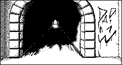
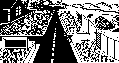
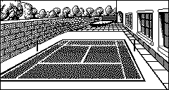
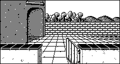

> [!WARNING]  
> This page contains potential spoilers for the game.  
> If you plan to play the game, you should probably refrain to go farther!
>
> For more information, you can safely read [Encounter.md](../Encounter.md)
- [Locations](#locations)
- [Locations in the code](#locations-in-the-code)
- [Description of the various locations](#description-of-the-various-locations)
- [The village](#the-village)
- [Outside the manor](#outside-the-manor)
- [The manor](#the-manor)
  - [The first floor](#the-first-floor)
  - [The second floor](#the-second-floor)
  - [The basement](#the-basement)


# Locations
There are 48 locations in the game, some can be directly accessed while some other require the player to do special actions such as opening a lock of bypassing an opponent or some other dangerous trap.

----
# Locations in the code 
Locations are defined in a static array containing all the locations: 

```
typedef struct 
{
  unsigned char directions[e_DIRECTION_COUNT_];   // +0 The six possible directions (NSEWUP)
  const char* script;                             // +6 Additional list of commands to add elements to the graphical view (speech bubble, etc...)
} location;  // sizeof = 8 bytes

extern location gLocations[e_LOC_COUNT_];      // Array containing all the locations
```

The current location of the player is stored in a global variable, and a pointer to the current location is also available for performance reason.
```
extern unsigned char gCurrentLocation;
extern location* gCurrentLocationPtr;
```

> [!NOTE]  
> If the size of the **location** structure changes, the code in **_ByteStreamComputeLocationPtr** ([bytestream.s](../code/bytestream.h)) has to be adapted else the scripting code will not work properly (and probably crash) when accessing any location.

**See:**
- [game_enums.h](../code/game_enums.h) for the list of all locations
- [game_defines.h](../code/game_defines.h) for the structures and declarations
- [Scripting](scripting.md) for more details about how the **script** commands work


----
# Description of the various locations

Here are information about the various locations you can reach in the game, grouped geographically:
- The village area
- The grounds around the manor house
- The three levels of the house

# The village
|Image|Description|
|-|-|
|**You are in a deserted market square**|e_LOC_MARKETPLACE|
||This is where the player starts their adventure. You can find a **plastic bag** (used as a container) and your **car** here.<br>You start with a **rough plan** and a **newspaper** in your inventory.|
|**You are in a dark, damp tunnel**|e_LOC_DARKTUNNEL|
||This humid tunnel contains **saltpetre** you can use to make **explosive powder**. There is some **graffiti** on the wall.|
|**You are in a wooded avenue**|e_LOC_WOODEDAVENUE|
||Contains a **dove** that you can capture with the **net**.|
|**You are near to an old-fashioned well**|e_LOC_WELL|
||Near the well you will find a **bucket** (used as a container), some **rope**, and obviously some **water**.|
|**You are in a dark, seedy alley**|e_LOC_DARKALLEY|
||This is where you find the **trashcan**|
|**You are on the main street**|e_LOC_MAINSTREET|
||There is a **church** here.|
|**You are in an open area of tarmac**|e_LOC_PARKING_PLACE|
||There is a **tombstone** here.|
|**An abandoned car**|e_LOC_ABANDONED_CAR|
||The **car** is a source of **petrol** from its tank|
|**You are on the eastern road**|e_LOC_EASTERN_ROAD|
||There is a **road sign** here.|
|**A long road stretches ahead of you**|e_LOC_ROAD|
|||
|**Outside a deep pit**|e_LOC_OUTSIDE_PIT
||This location did not exist in the original 1983 game, just going "east" would make you fall down in to the pit.<br>By adding this location, the player has to make a conscious effort instead of being surprised.<br>You can see a **tree**, the **pit**, and a **heap** of dirt here.|
|**You are inside a deep pit**|e_LOC_INSIDE_PIT|
||The pit contains some **sulphur** which can be mixed with the **saltpetre** to create the **explosive powder**|

# Outside the manor
|Image|Description|
|-|-|
|**You are on a wide gravel drive**|e_LOC_GRAVELDRIVE|
||(In the original 1983 game, the **alarm keys** were located here)|
|**You are on a huge area of lawn**|e_LOC_LAWN|
|||
|**A massive front door**|e_LOC_FRONT_ENTRANCE|
||There is a massive **front door** here.|
|**You are in a relaxing zen garden**|e_LOC_ZENGARDEN|
||The garden contains **fancy stones**|
|**You are on a lawn tennis court**|e_LOC_TENNISCOURT|
||This is where you find the **net** (used as a container to catch the **dove**)|
|**You are standing by a fish pond**|e_LOC_FISHPND|
||This is where you find the **hose**, **fish**, and **water**|
|**You are on a tiled patio**|e_LOC_TILEDPATIO|
||Above the passage is the **window** of the room where the **hostage** is being kept.<br>Trying to break the window triggers the **alarm**|
|**You are in an apple orchard**|e_LOC_ORCHARD|
||Here you can find a **ladder** (which can be used to go down the **pit** or reach the **basement window**), and some **apples** (which can be chopped with the **knife**)|
|**You are in a vegetable plot**|e_LOC_VEGSGARDEN|
||A **knife** is lying around.<br>On the wall you can see the small window to the basement dark room.<br>See: 'Soupirail', 'Fenêtres de trémie', 'Vasistas', 'Hopper window', 'Kellerfenster'|
|**You are in a small greenhouse**|e_LOC_GREENHOUSE|
||The greenhouse contains a **cardboard box** (used as a container), a **protection suit** (required to safely handle the **acid**), and **water**|

# The manor
## The first floor

|Image|Description|
|-|-|
|**You are in an imposing entrance hall**|e_LOC_ENTRANCEHALL|
||(In the original 1983 game, the **dog** was here. It is now on the **large staircase**)|
|**You are in the lounge**|e_LOC_LOUNGE|
||Here you can find a **tobacco tin** (used as a container for the **explosive powder**) and a **box of matches** (used to ignite the explosive).|
|**This looks like a library**|e_LOC_LIBRARY|
||In the library you will find a **chemistry book** providing some **chemistry recipes** as well as a **map** of England.|
|**Where serious Business happens**|e_LOC_STUDY_ROOM|
||This room contains a **computer**, an **invoice**, and a **gun cabinet** which contains the **dart gun**|
|**A dining room, or so it appears**|e_LOC_DININGROOM|
||On the dining table is some **bread** designed to attract the **dove**.|
|**This looks like a games room**|e_LOC_GAMESROOM|
||This room contains a **television**, a **game console**, a **TV cabinet** (which contains a **computer** that can access BASIC), and on the pool table you will find a **snooker cue**.|
|**You find yourself in a sun-lounge**|e_LOC_SUNLOUNGE|
||There is an **alarm indicator** on the wall.|
|**This is obviously the kitchen**|e_LOC_KITCHEN|
||The kitchen contains a **fridge** (with **meat** inside for the **dog**), a **medicine cabinet** (with sedative **pills** inside), a **mortar and pestle** (for grinding ingredients), and **water**.|
|**You are in a narrow passage**|e_LOC_NARROWPASSAGE|
|||

## The second floor

|Image|Description|
|-|-|
|**You are on a sweeping staircase**|e_LOC_LARGE_STAIRCASE|
||A very angry **dog** guards the staircase<br>(In the original 1983 game, the dog was in the entrance hall)|
|**You are on the main landing**|e_LOC_UP_STAIRS|
|||
|**This is the west gallery**|e_LOC_WESTGALLERY|
||There is a **curtain** here.|
|**You see a padlocked steel-plated door**|e_LOC_PANIC_ROOM_DOOR|
||This reinforced **door** blocks the player to access to the **kidnapped girl**.|
|**Inside the panic room** (virtual location)|e_LOC_HOSTAGE_ROOM|
||This is a **logical/virtual location** used for tracking items, specifically the **kidnapped girl**.<br>The player cannot actually visit this location directly.<br>Instead, they interact with it through the panic room door (e_LOC_PANIC_ROOM_DOOR)<br>by looking through the hole, or from outside via the tiled patio (e_LOC_TILEDPATIO)<br>where they can see the window.|
|**This is a small box-room**|e_LOC_BOXROOM|
||Contains a small **note** informing the player that some stuff is stored in the **safe** in the basement, and some **adhesive**.|
|**This seems to be a guest bedroom**|e_LOC_GUESTBEDROOM|
||There is a **drawer** (which contains **SR44 batteries** for powering small electronics) and a **Dune book** here.|
|**You are in a tiled shower-room**|e_LOC_SHOWERROOM|
||You can find **water** here.|
|**You have found the east gallery**|e_LOC_EASTGALLERY|
|||
|**You are in an ornate bathroom**|e_LOC_CLASSY_BATHROOM|
||You can find **water** here.|
|**This must be the master bedroom**|e_LOC_MASTERBEDROOM|
||A **thug** is sleeping on the bed. You can frisk him to obtain the **alarm keys** and a **pistol** from his pockets.<br>(In the original 1983 game, the keys were on the gravel drive outside)|
|**This is a tiny toilet**|e_LOC_TINY_WC|
||Here you can find a **roll of toilet paper** and **water**|
|**This is a child's bedroom**|e_LOC_CHILDBEDROOM|
||You can find a **handheld game** (which requires **SR44 batteries** to work, and lets you play the **Monkey King** game) and some **dried out clay** here.|

## The basement
|Image|Description|
|-|-|
|**You are on some gloomy, narrow steps**|e_LOC_BASEMENT_STAIRS|
|||
|**This is a cold, damp cellar**|e_LOC_CELLAR|
||The cellar contains a **safe** which has some **dangerous chemicals** in it, including a small **bottle of acid**.|
|**This room is even darker than the last**|e_LOC_DARKCELLARROOM||
||This is where you find the **control panel** that control the **alarm**.|
|**You are on a ladder at the basement window**|e_LOC_CELLAR_WINDOW|
||This location is reached by climbing UP from the dark cellar room when the **ladder** is positioned properly.<br>The window starts covered with **black tape** to prevent anyone from seeing inside, but the tape can be removed (this action cannot be undone).<br>From here you can see into the dark room below.|

