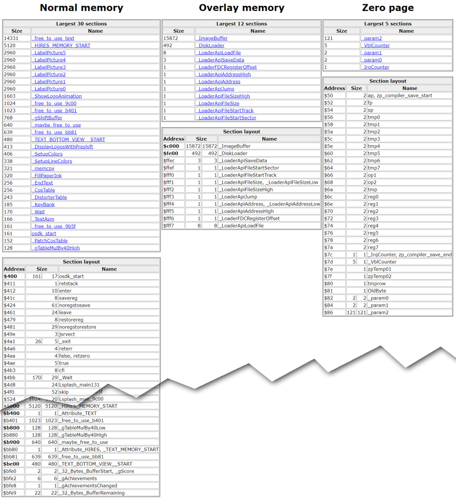

Memory
======

- [Memory](#memory)
  - [Memory in general](#memory-in-general)
  - [Memory on the Oric](#memory-on-the-oric)
  - [Overlay memory and floppy disk drive](#overlay-memory-and-floppy-disk-drive)
  - [FloppyBuilder system](#floppybuilder-system)
  - [System ROM](#system-rom)
- [Memory available in Encounter](#memory-available-in-encounter)
  - [Reserved locations](#reserved-locations)
    - [Page 1 - 6502 processor stack](#page-1---6502-processor-stack)
    - [Page 3 - Input/Output area](#page-3---inputoutput-area)
    - [Video memory and charsets](#video-memory-and-charsets)
    - [6502 vectors](#6502-vectors)
  - [Free areas](#free-areas)
    - [Page 0](#page-0)
    - [Page 2](#page-2)
    - [Page 4 to charsets](#page-4-to-charsets)
    - [Overlay memory](#overlay-memory)
  - [Total free memory](#total-free-memory)
- [Memory usage in Encounter](#memory-usage-in-encounter)
  - [Data sharing](#data-sharing)
  - [Loader API](#loader-api)
  - [Modules memory layout](#modules-memory-layout)
    - [Showing free memory](#showing-free-memory)
    - [Symbol files and memory maps](#symbol-files-and-memory-maps)
  - [Individual notes about the various modules](#individual-notes-about-the-various-modules)
    - [Splash/Jingle sequence](#splashjingle-sequence)
    - [Intro sequence](#intro-sequence)
    - [Main game](#main-game)
      - [Video memory:](#video-memory)
    - [End credits](#end-credits)

## Memory in general
On modern machines, with a lot of RAM and virtual memory, optimizing memory usage is mostly a thing of the past: Doing it may definitely improve performance, but it's not an actual requirement to get things running at all.

On a 8bit computer, you have a fixed quantity of memory, no virtualization, fixed locations for I/O, hardware vectors and CPU stack, sometimes you have some form of memory banking, but that's about it.

## Memory on the Oric
Encounter is designed to run on Oric computers with 64KB of RAM, which includes all the machines (Oric 1, Oric Atmos, Telestrat, Oric Nova 64 and Pravetz 8D) with the exception of the 16KB Oric 1 (and technically 16KB Oric Atmos but I have never seen a real one).

The Telestrat has 64KB and can be extended to 128KB using ram cartridges, but this is not supported.

## Overlay memory and floppy disk drive
The Oric Atmos 48K actually has 64KB of RAM, it just happens that the top 16KB of RAM are located at the same location as the 16KB of ROM, and the machine does not come with the necessary circuitry to select the one you want to use.

When a floppy disk drive (Microdisc or Jasmin) is connected to the Oric, it comes with a controller board providing the missing circuitry as well as a boot ROM able to bootstrap the system.

The 16KB of RAM become available under the name of "Overlay memory", and are used by the system to store the DOS, generally with a bit of RAM in page[^1] 4 sacrificied to handle the dispatching between BASIC ROM and DOS RAM depending of what the user or applications are doing.

## FloppyBuilder system
A proper DOS is useful when you need to be able to create or delete files, rename them, modify them, etc... which requires maintaining some directory structure to keep track of the location of files, handling fragmentation, etc...

In the case of games or demos, most of the content is static and known 100% at build time, handling things like game saves can be done using preallocated fixed locations on disks (called "slots"), which means you can avoid the requirement for a directory structure, and if all the files are nicely laid out linearly, all you need is to know the position of the first sectors as well as the size of the file.

This is exactly what the Floppy Builder system is doing.

Using a [master script filescripting.h](../code/floppybuilderscript_master.txt) describing the list of all files required to build the floppy disk, the Floppy Builder generates both a .DSK file and a [layout file](../build/floppy_description.h) which can be used by the game loader to access easily all the files.

Since the system is much simpler, most of the features of a proper DOS are not required, all that is needed is code able to read and save bunch of sectors, plus some fancy features such as the ability to decompress data on the fly.

As a result, the [loader](../code/loader.asm) is about 768 bytes in total, to which you can add a couple simple functions for the [loader api](../code/loader_api.h)

## System ROM
Technically it's possible to still access the system ROM, but the Oric 1, Oric Atmos and Telestrat have vastly different ROMs with different access points, making the compatibility quite problematic.

Assuming the compatibility is properly handled, using the system ROM comes with a significant set of constraints since the ROM uses most of the pages 0 and 2 to keep track of system information.

The choice was made to not use the ROM at all, which means we have to initialize and manage the hardware ourself, and we also need to reimplement all the base functionalities like keyboard handling, changing video mode, timers, etc...

In exchange, we gain full liberty on how we use the memory, including pages 0, 1 and 2.

# Memory available in Encounter
So, we have much more memory available with this system than we would have with a normal game on tape or even using a standard Sedoric format, but that does not mean we can do whatever we want.

## Reserved locations
The Oric is a 6502 based system, which means a certain number of locations are imposed and cannot be avoided, plus some hardware choices made by the Oric company when they designed the machine.

### Page 1 - 6502 processor stack
The memory area from $100 to $1FF is used by the 6502 everytime an interuption is handled, a jump to subroutine performed, or a push accumulator is done.

We can technically use some of it if we are sure we don't use too many recursion calls, but that's about it.

### Page 3 - Input/Output area
The entire area from $300 to $3FF is reserved for the hardware registers for peripherals such as the 6522 VIA or the floppy disk controller board, unused locations are not mapped to memory, so it's not possible to store anything there

### Video memory and charsets
The Oric has a convoluted video memory system, with a TEXT mode (40x28 character) located from $BB80 to $BFDF and a HIRES mode (240x200 pixels plus three additional lines of characters) located from $A000 to $BFDF.

Each of these modes have two associated character sets called STD (standard) and ALT (alternate).

Each of these character sets occupies 1024 bytes, but since the characters from 0 to 31 are not displayable, only 768 bytes are actually used, which leaves 256 bytes free at the start of each charset.

The two TEXT charset are located at $B400 (STD) and $B800 (ALT), while the two HIRES charset are located at $9800 (STD) and $9C00 (ALT).

There is also a small zone of 32 bytes located at the end of the screen and just before the ROM area, from $BFE0 to $BFFF, which is generally not used but is extremely practical to store resident information in a program made of multiple parts that need to communicate.

### 6502 vectors
At the very end of the addressable space are 6 bytes which have special significance to the processor:
- NMI - from $FFFA to $FFFB contains the address where the CPU jumps when the reset button is pressed
- RESET - from $FFFC to $FFFD is only used when the machine starts to define where the system boot code is located
- IRQ/BRK - from $FFFE to $FFFF is the most important one and contains the location of the IRQ vector called when a VIA timer interuption triggers, or when a BRK instruction is executed by the processor

## Free areas
So by elimination this leaves all these free for our use:
### Page 0
Since the ROM is not executed, we have full access to these 256 bytes of scratch memory

### Page 2
The Page 2 is normally used by the ROM to store book-keeping data (video mode, timer values, exception handlers, ...) but since the ROM is not present we have full access to it.

### Page 4 to charsets
It's hard to provide a fixed end address since what is available depends of the video combination, but basically we have a solid chunk of memory available from $400 to $B400 (45056 bytes) if we are using TEXT mode, and from $400 to $9800 (37888 bytes) if we are using HIRES mode.

### Overlay memory
Since we are not using a DOS, we have access to all the memory from $C000 to $FFFF (16384 bytes), minus the room used by the loader and the exception vectors (about 768 bytes), which leaves us with about 15616 bytes.

## Total free memory
So, in total, here what we have available assuming a worse case situation (HIRES mode):
-   256 bytes - Page 0 
-   256 bytes - Page 2
- 37888 bytes - Main memory
- 15616 bytes - Overlay memory
-------------------------------
Total = 54016

# Memory usage in Encounter
Encounter is split in four distinct modules:
- Splash/Jingle
- The intro sequence
- The actual game
- The high-score/credits outro

Each module have their own individual memory usage, the only shared elements are:
- The loader module in the last 768 bytes of memory
- The 32 byte zone from $BFE0 to $BFFF

## Data sharing
To provide some context to the game when moving from a module to another, the 32bytes buffer is used to keep information.

The memory locations are specified in [last_module.s](../code/last_module.s)
> [!NOTE]  
> Should probably have a C struct to cleanly wrap that to the main code.
```c
* = $BFE0  // The 32 bytes of RAM between the end of the screen and the start of the ROM

_32_Bytes_BufferStart
_gScore                 .dsb 2   // Current highscore for the player
_gAchievements          .dsb 7   // Enough for 7*8=56 achievements
_gAchievementsChanged   .dsb 1   // Set to 1 to indicate the game that the achievements have changed and need to be resaved
_32_Bytes_BufferRemaining

* = $C000  //Start of the ROM/Overlay ram
```
By having the current score and the achievement info in higher memory, the main game does not have to keep the entire high score file in memory at all time, it is loaded or saved only in the intro and outro modules.

## Loader API
Since the loader module is installed in memory during the boot sequence and never moves, the simplest way to implement an API to perform disk operation was to reserve some addresses directly at the end of the module at fixed locations. These are defined in the [loader api](../code/loader_api.s) file.
```c
_LoaderApiSaveData       =$FFEC  

_LoaderApiFileStartSector=$FFEF
_LoaderApiFileStartTrack =$FFF0

_LoaderApiFileSize       =$FFF1
_LoaderApiFileSizeLow    =$FFF1
_LoaderApiFileSizeHigh   =$FFF2

_LoaderApiJump           =$FFF3
_LoaderApiAddress        =$FFF4
_LoaderApiAddressLow     =$FFF4
_LoaderApiAddressHigh    =$FFF5

_LoaderFDCRegisterOffset =$FFF6

_LoaderApiLoadFile       =$FFF7
```
Since the addresses are fixed in memory, there is no need for relocation or fancy bindings, the lodding/saving code just writes the values at these fixes addresses and call the various vectors, like "LoadFile" (jsr $FFF7) and "SaveData" (jsr $FFEC).

## Modules memory layout
Each of the module has their own memory layout, most automatically laid out by the linker and assembler when assembling together all the zero page[^3], text, data and  bss sections.

The [last_module.s](../code/last_module.s) file is special and has to be placed at the very end of the list of files in each module:
```
:: These are the definition of the various files used by each module.
:: After a module has been built once, and as long as the files are not deleted, you can
:: then comment out the line to speed up compile time.
:: Obviously remember to enable them again else the changes you make will not be rebuilt!
SET OSDKFILE_SPLASH=splash_main splash_utils display_basic loader_api irq keyboard distorter costable last_module
SET OSDKFILE_INTRO=intro_main score common intro_utils intro_text loader_api irq audio keyboard time display_basic akyplayer last_module
SET OSDKFILE_GAME=game_main bytestream common game_misc game_data game_text game_utils loader_api irq audio keyboard time display_basic display last_module
SET OSDKFILE_OUTRO=outro_main score outro_text input_system common outro_utils loader_api irq audio keyboard display_basic display last_module
```
This is where most of the fancy trickery to get more memory is done:
- Defining symbols for buffers in overlay memory
- Defining symbols in tricky areas like unused parts of the character sets

### Showing free memory
The last_module.s file is also where the "Remaining space" message printed at build time comes from:
```c
#if DISPLAYINFO=1
#print Remaining space = ($9800 - *)  
#endif
```
like for example in this terminal output:
```
== Compiling the intro ==
Building the program IntroProgram at adress $400 [OSDK 1.20]
Linking
Assembling
Remaining space = ($9800 - *)  = 7028
Creating TAPE image IntroProgram.TAP
File 'build\IntroProgram.tap' is 31134 bytes long (14 bytes header and 31120 bytes of data)
Build of IntroProgram.tap finished
```

using the #print statement can be done directly in the modules to clearly show which part of the program take room, like for example in the game:
```
Total size of game text content = (_EndGameTextData - _StartGameTextData)= 7371
- Messages and prompts = (_EndMessagesAndPrompts - _StartMessagesAndPrompts)= 331
- Error messages = (_EndErrorMessages - _StartErrorMessages)= 594
- Location names = (_EndLocationNames - _StartLocationNames)= 1323
- Item names = (_EndItemNames - _StartItemNames)= 1002
- Scene scripts = (_EndSceneScripts - _StartSceneScripts)= 2823
- Scene actions = (_EndSceneActions - _StartSceneActions)= 1298
Remaining space = ($9800 - *)  = 2292
```
this is simply achieved by using the symbols to compute and print the size at compile time:
```c
//
// Print statistics about the size of things
//
#print Total size of game text content = (_EndGameTextData - _StartGameTextData)
#print - Messages and prompts = (_EndMessagesAndPrompts - _StartMessagesAndPrompts)
#print - Error messages = (_EndErrorMessages - _StartErrorMessages)
#print - Location names = (_EndLocationNames - _StartLocationNames)
#print - Item names = (_EndItemNames - _StartItemNames)
#print - Scene scripts = (_EndSceneScripts - _StartSceneScripts)
#print - Scene actions = (_EndSceneActions - _StartSceneActions)
```

### Symbol files and memory maps
The compilation of each module results in the creation of a specific file (symbols_SplashProgram, symbols_IntroProgram, symbols_GameProgram, symbols_OutroProgram) containing all the symbols for this specific module.

The content typically looks like that:
```
0050 zp_compiler_save_start
0050 ap
0052 fp
0054 sp
0056 tmp0
0058 tmp1
(...)
10c5 _main
0412 enter
0424 noregstosave
041c savereg
(...)
0538 Lsplash_main132
04d8 Lsplash_main131
12cb IrqTasks50hz
165f ReadKeyboard
12cf _gIsHires
12d0 _gPrintAddress
(...)
bfe2 _gAchievements
bfe8 _gAchievementsChanged
bfe9 _32_Bytes_BufferRemaining
fe00 _DiskLoader
6000 osdk_check
```
The main use of these symbol files is to provide symbols when debugging the code in an emulator, it's easier to read **JSR ReadKeyboard** than **JSR $165f**.

A second usage is the generation of easy to read "map files" showing tables with all the symbols sorted, with display of how much memory is used by each of the symbols.

The OSDK provides the MemMap.exe program which can convert these files into HTML files, by default the osdk_showmap.bat script is used to generate them, resulting in this type of output:


The three columns represent the three main memory types:
- The symbols defined from $100 to $BFFF, called "Normal memory"
- Anything defined in the $C000 to $FFFF range, called "Overlay memory"
- And anything defined in $00 to $FF range, called "Zero page"

Each of these columns has two sections:
- At the top is the list, sorted from larged to smallest of the various memory zones located for the memory type
- At the bottom is the list of all labels sorted increasingly

The address shown in bold indicate it is aligned on a multiple of 256[^2]

And finally, the size of each section is shown, calculated based on how many bytes separate one label from another.

Global labels (starting by _) have two Size values, the additional one represented hos many bytes separates this label from the next global label, so by smartly using a _ prefix, you can fine grain the reports.

This tool is quite practical to find the worse offenders as well as where you have free memory, or locate places that should have been alligned by are not.


## Individual notes about the various modules
(This is a work in progress)
### Splash/Jingle sequence
### Intro sequence
### Main game
Let's try to squeeze out the last remaining bits of memory:
- The loader is located in $fb00, with the resident part using from $fb88 to $ffff
- Page 2 is used for the sector buffer when loading and saving
- The game loads at $400

#### Video memory:
- HIRES attribute is in the fist byte of the TEXT memory in $bb80
- TEXT attribute is in the first byte of the 128th HIRES line in $a000+40*128
- We have 128 HIRES lines (16 TEXT lines) for the HIRES window at the top: All the area from $A000 to $B400 ($a000+40*128) are used by the HIRES graphics
- We have 12 TEXT lines for the TEXT window at the top: 12+16=28         : All the area from $BE00 ($bb80+40*16) to $BFDF are used by the TEXT mode
- Since we switch to TEXT for the bottom line, we do not use any of the HIRES charsets
- We only use the visible part of the STD charset, from $B500 ($B400+32*8) to $B800 ($b400+128*8)

- A000-B3FF - HIRES
- B400-B4FF - Free
- B500-B7FF - STD Charset
- B800-BDFF - Free
- BE00-BFDF - TEXT


### End credits


----
[^1]: You can think of the 65536 bytes of memory as being made of 256 "pages" of 256 bytes.
[^2]: Quite a few operations are faster on the 6502 if you do not cross a page boundary
[^3]: Operations done in zero page are faster for the 6502 because there is one less byte to load to compute the location in memory
