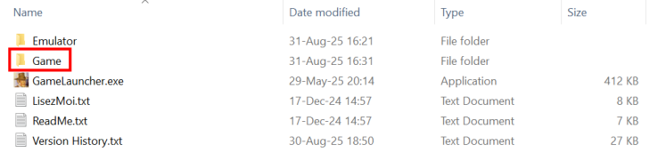
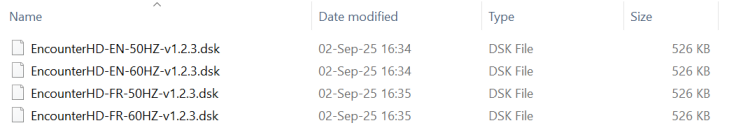
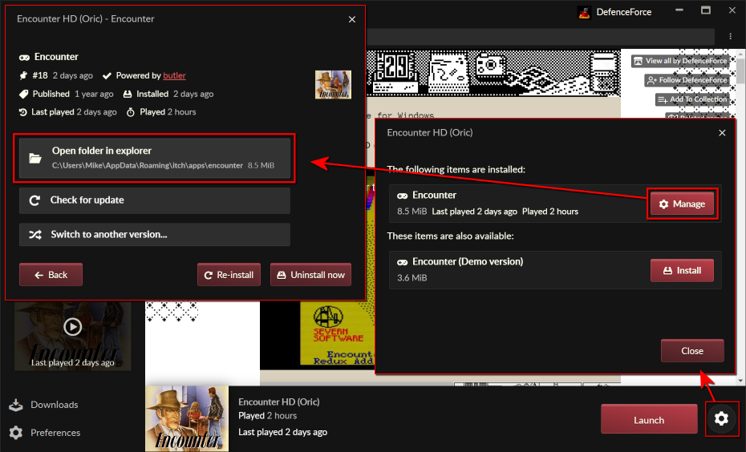
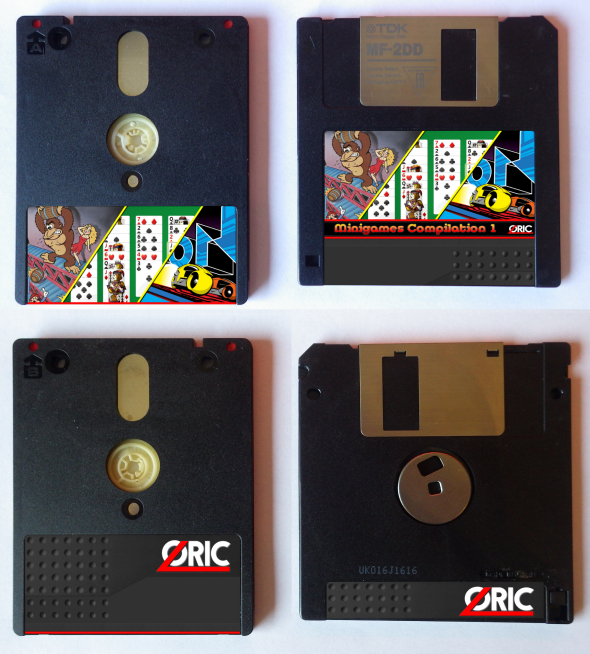

**Physical Edition**

- [Floppy](#floppy)
  - [Finding the game images](#finding-the-game-images)
    - [From a zip archive](#from-a-zip-archive)
    - [Using the Itch.io application](#using-the-itchio-application)
  - [Using the .DSK directly](#using-the-dsk-directly)
  - [Converting to .HFE](#converting-to-hfe)
- [Packaging](#packaging)
  - [Floppy sticker](#floppy-sticker)
  - [Box inlay](#box-inlay)
  - [Box insert](#box-insert)

For the ultimate retro experience, nothing beats playing Encounter on a real Oric on a real 3" Microdisc.

Considering how expensive/rare 3" floppies are, and the fact not many people actually do own a Microdisc unit, it makes no sense from a money perspective to provide a full physical version of Encounter (prove me wrong!)

That being said, for the ones among you who wish to play on the real machine, it's quite easy, and I'll be providing here the necessary elements to help you build your own decent looking real edition of Encounter!

# Floppy

For practical reasons, Encounter is distributed as a .DSK file.

In the retro world there are many different file formats using the same extension, so in this context we are talking of the .DSK file format which was used by Euphoric (the first decent Oric Emulator), and later used by Oricutron and Cumulus.

If you own a old PC with a real DOS compatible system and a proper disk controller, you could directly use the .DSK file, but for most other setups you will have to convert to another format called .HFE.

## Finding the game images

Depending where you got the game from, the method to find the .DSK image files will be slightly different, but ultimately they will be present in the "Game" subfolder: 

Here is the root content of the folder with the launcher and the Game folder

And here you have the four variants of the game:

You need to select the one you want to use:

- EN or FR defines the language (English or French)
- 50HZ or 60HZ defines the display frequency on your screen
- "vx.y.z" defines the version of the game
- And "Demo" will be present for demo versions of the game

Obviously you should pickup the language you are the most comfortable with, but regarding the frequency it really depends on the video system you will be using: Some very old television sets do not like 60HZ frequency at all, in which case you should go for the 50HZ version, but otherwise 60HZ gives a more stable picture which is less exhausting to look at, and it also makes the aspect ratio less squished.

### From a zip archive

### Using the Itch.io application

## Using the .DSK directly

## Converting to .HFE

# Packaging

## Floppy sticker

## Box inlay

blo

## Box insert

blib

